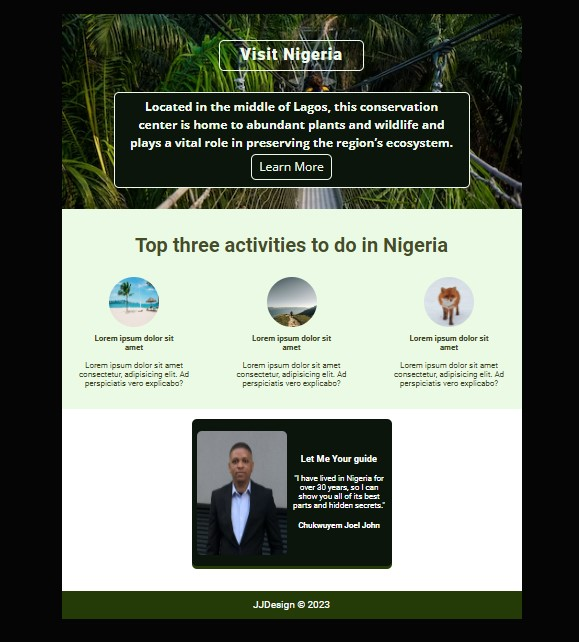

Readme

This is a website for showcasing the attractions and activities in a fictional hometown. The website is built using HTML and CSS.

Features

    Hero section with a background image and a call-to-action button
    Activities section with images and descriptions of various activities in the hometown
    Guide section with a photo and description of a local guide
    Footer with contact information

    

Setup

    Clone the repository or download the files.
    Open the index.html file in a web browser.

Usage

The website can be used as a template for creating a similar website for a different hometown.
Credits

    Background image in the hero section: https://unsplash.com/photos/TLzCjB1YH_0
    Font used: Roboto and Open Sans from Google Fonts
    Scrimba:    Frontend Development Career path

